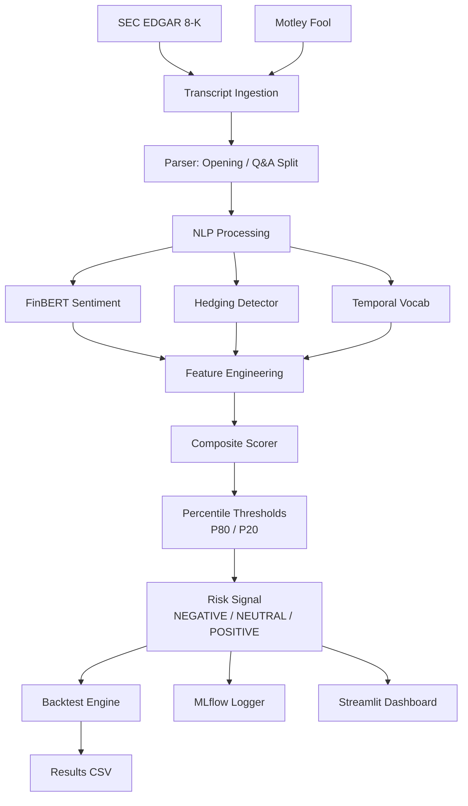
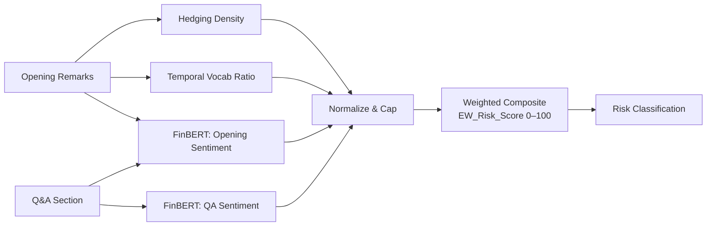
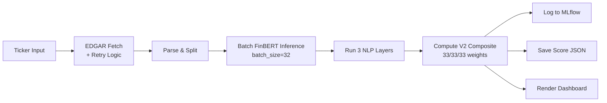

<div align="center">

<!-- Banner placeholder — see Assets section at bottom for mockup concept -->
<!--  -->

<h1>EarningsEcho</h1>

<p><strong>Quantify executive uncertainty from earnings-call language to forecast post-earnings drift.</strong></p>

<p>
  <a href="https://earningsecho.streamlit.app">🚀 Live Demo</a> ·
  <a href="#system-architecture">⚙️ Architecture</a> ·
  <a href="#quantitative-results">📊 Results</a> ·
  <a href="#dataset">🗂 Dataset</a>
</p>

<p>
  <a href="https://python.org"></a>
  <a href="https://huggingface.co/ProsusAI/finbert"></a>
  <a href="https://earningsecho.streamlit.app"></a>
  <a href="https://mlflow.org"></a>
  <a href="LICENSE"></a>
</p>

<p><strong>264 transcripts · 40 S&P 500 tickers · 5 sectors · 3 orthogonal signals · 1 risk score</strong></p>

</div>

---

## Table of Contents

- [Problem Statement](#problem-statement)
- [Why This Matters](#why-this-matters)
- [Feature Showcase](#feature-showcase)
- [System Architecture](#system-architecture)
- [Quantitative Results](#quantitative-results)
- [Dashboard Showcase](#dashboard-showcase)
- [Tech Stack](#tech-stack)
- [Repository Structure](#repository-structure)
- [Installation & Quick Start](#installation--quick-start)
- [What Makes This Different](#what-makes-this-different)
- [Production Engineering](#production-engineering)
- [Resume Impact](#resume-impact)
- [Future Roadmap](#future-roadmap)
- [Honest Limitations](#honest-limitations)
- [Citation & License](#citation--license)

---

## Problem Statement

Institutional investors employ teams of analysts to decode earnings calls — hour-long Q&A sessions where executives defend guidance, calibrate expectations, and reveal confidence they never state directly. The linguistic tells are subtle but economically meaningful: hedged commitments, sentiment deterioration under analyst pressure, and narrative retreat from forward guidance to past achievements.

Retail investors capture none of this signal. They read polished press releases. The market, in turn, systematically underprices linguistic uncertainty because it is invisible to conventional price-and-volume quantitative signals.

EarningsEcho attacks this information asymmetry by extracting three **orthogonal linguistic predictors** from earnings-call transcripts and fusing them into a single, backtested, explainable risk score.

> *"We remain cautiously optimistic about the potential for improvement in the broader macroeconomic environment, subject to conditions that may or may not materialise."*
>
> **Translation:** *We have no idea what's happening next. And we're not going to tell you.*

---

## Why This Matters

### Three Uncorrelated Predictors

Most sentiment systems collapse everything into "positive vs negative." EarningsEcho treats polarity, epistemic uncertainty, and temporal narrative focus as **independent signals**:

| Predictor | Captures | Why It Is Orthogonal |
|-----------|----------|---------------------|
| **Hedging density** | Epistemic distance from commitments ("we believe," "subject to") | A CEO can hedge a *positive* statement. Polarity and uncertainty are not the same thing. |
| **Negative sentiment** | Tonal pessimism via FinBERT classification | Captures directional mood independent of commitment strength. |
| **Backward vocabulary ratio** | Temporal narrative focus (past achievements vs future guidance) | Measures guidance avoidance — a distinct behavioral signal from mood or hedging. |

These three signals are deliberately designed to be **non-collinear**. A transcript can score high on sentiment positivity while also scoring high on hedging density — and that exact combination often precedes the largest negative post-earnings moves.

### The Source-Quality Result

The project's primary research finding is about **data quality, not model complexity**:

| Source | NEGATIVE Signal Accuracy | Sample |
|--------|--------------------------|--------|
| Full call transcripts (Motley Fool) | **71.4%** | n=7 directional |
| Press release summaries (EDGAR) | **56.5%** | n=46 directional |

The **15 percentage-point gap** demonstrates that live Q&A — where executives cannot prepare answers — encodes linguistic uncertainty absent from polished written summaries. A simple hedging detector on a real transcript outperforms a sophisticated model on a cleaned document.

> **Core insight:** `source_quality > model_complexity` for linguistic alpha.

### Explainability as a First-Class Feature

Every EW_Risk_Score is fully decomposable. The SHAP-style explainer shows exactly which phrases drove the hedging score, weighted by linguistic category. No post-hoc LIME. No black-box approximations. The explanation is the model.

---

## Feature Showcase

<div align="center">

<table>
<tr>
<td width="50%" valign="top">

**🔬 NLP Signal Extraction**

Three-layer pipeline:
- FinBERT sentence-level sentiment
- Custom hedging lexicon (69 phrases, 4 linguistic categories)
- Temporal vocabulary ratio (forward vs backward)

</td>
<td width="50%" valign="top">

**🛡️ Hedging / Uncertainty Scoring**

Density-normalized per 100 words. Category-weighted contributions (epistemic > shield > plausibility > approximator).

</td>
</tr>
<tr>
<td width="50%" valign="top">

**📉 Earnings Risk Signal**

EW_Risk_Score (0–100) with corpus-wide P80/P20 percentile thresholds. Tri-state: POSITIVE / NEUTRAL / NEGATIVE.

</td>
<td width="50%" valign="top">

**🔍 Explainability**

Per-phrase contribution charts. Transcript highlighting (amber=hedging, pink=negative). Component progress bars.

</td>
</tr>
<tr>
<td width="50%" valign="top">

**📊 Backtesting Engine**

1d/3d/5d post-earnings returns. Directional accuracy. Annualized Sharpe. Binomial p-values. Walk-forward validation.

</td>
<td width="50%" valign="top">

**🖥️ Interactive Dashboard**

6-tab Streamlit app with real-time EDGAR pipeline, corpus scatter, and bilingual AI summaries.

</td>
</tr>
</table>

</div>

---

## System Architecture

### End-to-End Data Flow



### NLP Pipeline Detail



### Inference Flow (Live Pipeline)



---

## Quantitative Results

### Headline Metrics (5-Day Window)

| Metric | Value | Interpretation |
|--------|-------|----------------|
| **Directional Accuracy** | **53.8%** | n=106 directional signals (P80/P20) |
| **Signal Sharpe** | **2.174** | Long-short annualized; gross of costs |
| **Buy-and-Hold Sharpe** | **-0.896** | Same universe, same period |
| **Binomial p-value** | **0.31** | H₀ = 50% random; not significant at α=0.05 |

### Signal Quality Assessment

| Property | Value | Assessment |
|----------|-------|------------|
| Effect size (Cohen's h) | 0.076 | Negligible |
| Min n for 80% power | ~1,357 | Current corpus underpowered |
| Achieved power at n=106 | ~0.09 | Underpowered |
| Coverage (directional signals) | 40% | 60% classified NEUTRAL |

> **Honest read:** The directional edge is small and not statistically significant at conventional levels. The economic case rests on the Sharpe ratio (positive vs negative buy-and-hold) and the consistent source-quality finding, not on hypothesis-test confidence. This is a research prototype, not a production trading system.

### Source Split

| Source | NEGATIVE Accuracy | n | p-value |
|--------|------------------|---|---------|
| Motley Fool (full transcripts) | **71.4%** | 7 | 0.31 |
| EDGAR (press releases) | **56.5%** | 46 | 0.37 |

### Sector Breakdown (5-Day)

| Sector | Accuracy | n |
|--------|----------|---|
| Consumer | **64.5%** | 31 |
| Healthcare | 56.5% | 23 |
| Financials | 51.7% | 29 |
| Technology | 41.7% | 12 |
| Energy | 36.4% | 11 |

### Ablation Study (n=106)

| Configuration | Weights (H/S/V) | Accuracy | Rank |
|--------------|-----------------|----------|------|
| **Equal weights (V2)** | 0.33 / 0.33 / 0.33 | **57.55%** | 1 |
| Four-signal (+trajectory) | 0.35 / 0.30 / 0.20 + 0.15 | 56.60% | 2 |
| Hedging + Sentiment | 0.50 / 0.50 / 0.00 | 55.66% | 3 |
| Original V1 | 0.40 / 0.35 / 0.25 | 54.72% | 4 |
| Hedging only | 1.00 / 0.00 / 0.00 | 51.89% | 5 |
| Sentiment only | 0.00 / 1.00 / 0.00 | 49.06% | 6 |
| Vocabulary only | 0.00 / 0.00 / 1.00 | 48.11% | 7 |
| No hedging | 0.00 / 0.50 / 0.50 | 46.23% | 8 |

> The ablation validates the design: equal-weight combination outperforms any single signal, and removing hedging causes the largest accuracy drop. The V2 configuration is now the live default.

### ML vs Rule-Based (Chronological Split)

| Model | Accuracy | Coverage | ROC-AUC | Notes |
|-------|----------|----------|---------|-------|
| **Rule Baseline (P80/P20)** | **54.81%** | 59.5% | 0.552 | Train-period thresholds only |
| Logistic Regression | 48.46% | 100% | 0.486 | Full coverage, lower accuracy |
| Random Forest | 47.58% | 100% | 0.473 | Overfits on small feature set |
| Gradient Boosting | 46.26% | 100% | 0.481 | Chronological split hurts trees |

> The rule-based percentile approach generalizes better than supervised classifiers on this sparse, non-linear signal — a finding that favors interpretability and reduces overfitting risk.

### Walk-Forward Validation (2025+)

| Metric | Value |
|--------|-------|
| Expanding-window accuracy | **55.5%** |
| Static-threshold accuracy (same period) | 55.5% |
| Look-ahead bias | None |

---

## Dashboard Showcase

<div align="center">

<!--  -->
*Landing page: headline metrics + 264-point corpus scatter by sector*

</div>

The 6-tab Streamlit dashboard is live at **[earningsecho.streamlit.app](https://earningsecho.streamlit.app)**.

| Tab | What You See |
|-----|-------------|
| **📊 Risk Score** | Plotly gauge (0–100), three component progress bars, SHAP-style hedge phrase chart with category colors |
| **📄 Transcript** | Full text: hedging phrases in amber, negative sentences in pink, Opening/Q&A split tabs |
| **📈 Price Chart** | Candlestick ±15 days around earnings date, risk score annotation, earnings-day vertical marker |
| **🔁 Backtest** | EDGAR vs MF accuracy table, Sharpe comparison, top-5 riskiest calls, window breakdown |
| **🗂 Corpus Scatter** | All 264 calls: EW_Risk_Score vs 5d return, colored by sector, current call highlighted in gold |
| **🌐 Bilingual** | AI-generated English + Hindi risk explanation (Grok API, optional) |

<div align="center">

<!--  -->
*Risk Score tab: animated gauge, component bars, and phrase-level SHAP explanation*

<!--  -->
*Transcript tab: linguistic markup makes the NLP methodology tangible*

<!--  -->
*Backtest tab: source split, accuracy metrics, and top-5 highest-risk calls*

</div>

---

## Tech Stack

<div align="center">

| Layer | Tools | Why This Choice |
|:-----:|:-----:|-----------------|
| **NLP** | `transformers` · FinBERT · `nltk` | Domain-specific financial BERT; batch inference optimized for CPU (batch=32) |
| **Modeling** | `scikit-learn` · `scipy` · `numpy` | Ablation studies, ML comparisons, statistical tests, power analysis |
| **Data** | `yfinance` · `requests` · `BeautifulSoup4` | Free market data; EDGAR + Motley Fool scraping with `tenacity` retry logic |
| **Dashboard** | `Streamlit` · `Plotly` | 1-command deploy; interactive candlesticks, scatter, gauges |
| **Tracking** | `MLflow` | Experiment logging with params, metrics, artifacts on every live run |
| **Explainability** | Custom SHAP-style | Phrase-level contribution by category; zero external SHAP dependency |
| **Utilities** | `loguru` · `tenacity` · `tqdm` | Structured logging, exponential backoff, progress bars |

</div>

---

## Repository Structure

```
EarningsEcho/
│
├── config/
│   ├── settings.py              # Percentile thresholds, return windows, weight versioning
│   └── universe.json            # 40 S&P 500 tickers across 5 sectors
│
├── dashboard/
│   └── app.py                   # Streamlit 6-tab dashboard with resource + data caching
│
├── data/
│   ├── scores/                  # 264 score JSONs (one per filing)
│   ├── transcripts/             # Raw + parsed transcript JSONs
│   ├── plots/                   # Sector accuracy heatmap, hedge density boxplots
│   ├── backtest_results.csv     # Master results: signals + returns
│   ├── ablation_results.csv     # 8 weight configurations
│   ├── ml_comparison_results.csv # Chronological train/test: LR/RF/GB vs rule baseline
│   ├── walkforward_results.csv  # Expanding-window P80/P20 validation
│   ├── sector_analysis_results.csv # Sector x window accuracy + ANOVA
│   ├── confidence_intervals_results.csv # Wilson 95% CIs
│   └── power_*.csv              # Effect sizes, min-n tables, achieved power
│
├── docs/
│   ├── key_findings.md          # Research summary
│   └── exam_presentation.md     # Viva Q&A guide
│
├── scripts/
│   └── run_motleyfool_pipeline.py # Batch Motley Fool ingestion
│
├── src/
│   ├── ingestion/               # EDGAR crawler, Motley Fool scraper, parser
│   ├── nlp/                     # FinBERT, hedging detector, vocab scorer, composite, SHAP explainer
│   ├── backtest/                # Return computation, signal assignment, statistics
│   ├── experiments/             # Ablation, ML comparison, walk-forward
│   ├── analysis/                # Sector analysis, power analysis, confidence intervals
│   └── tracking/                # MLflow logger
│
├── run_experiments.py           # One-command reproduction of all experiments
├── packages.txt                 # Streamlit Cloud system deps
└── requirements.txt             # Python dependencies
```

---

## Installation & Quick Start

### Option 1: Live Demo (No Install)

Browse all 264 pre-scored transcripts instantly:

**[→ earningsecho.streamlit.app](https://earningsecho.streamlit.app)**

### Option 2: Run Locally

```bash
# Clone
git clone https://github.com/10anshika/EarningsEcho.git
cd EarningsEcho

# Install
pip install -r requirements.txt

# Launch dashboard (loads from pre-scored corpus)
streamlit run dashboard/app.py
```

### Option 3: Live Pipeline (New Tickers)

Type any S&P 500 ticker in the sidebar → click **Analyze**:

```
EDGAR Fetch → Parse → 3-Layer NLP → Composite Score → MLflow Log
```

~60 seconds end-to-end. No API key required for EDGAR.

### Reproduce All Experiments

```bash
# Everything: ML comparison + ablation + walk-forward
python run_experiments.py

# Individual modules
python -m src.experiments.ablation_study
python -m src.experiments.ml_comparison
python -m src.experiments.walkforward_backtest
python -m src.analysis.sector_analysis
python -m src.analysis.power_analysis
python -m src.analysis.confidence_intervals

# View MLflow tracking server
mlflow ui  # http://localhost:5000
```

### Optional: Bilingual Explainer

Add a Gemini API key to `.streamlit/secrets.toml` for English + Hindi summaries:

```toml
GEMINI_API_KEY = "your-key-here"
```

Notes
-----
- The bilingual explainer calls the Gemini endpoint (`https://generativelanguage.googleapis.com/v1beta/models/gemini-2.0-flash:generateContent`). If `GEMINI_API_KEY` is missing, Tab 6 will show an error and no summary will be generated.


---

## What Makes This Different

<div align="center">

| Typical Sentiment Project | **EarningsEcho** |
|:--------------------------|:-----------------|
| Generic polarity score | **Three orthogonal signals** (hedging, sentiment, temporal focus) |
| Single bag-of-words model | **Research pipeline** with ablation-validated weights |
| Static demo | **Backtested signal** with walk-forward validation |
| Black-box predictions | **Explainable scoring** — every phrase contribution is visible |
| No quantitative rigor | **Statistical power analysis, Wilson CIs, Cohen's h** |
| No experiment tracking | **MLflow integration** on every live analysis run |
| Single data source | **Source-quality finding**: live transcripts vs press releases |
| No deployment | **Production Streamlit app** at earningsecho.streamlit.app |

</div>

---

## Production Engineering

### Reproducibility by Design
- All thresholds, weights, and normalization caps are **versioned in config** (V1: 40/35/25 → V2: 33/33/33, ablation-validated)
- One command (`python run_experiments.py`) reproduces every table and chart
- Chronological train/test splits prevent data leakage in ML comparisons

### Experiment Tracking
- Every live analysis is logged to MLflow with full params, metrics, and score artifacts
- Ablation, ML comparison, walk-forward, sector, and power analyses all produce versioned CSVs

### Modularity
- Clean separation: `ingestion → nlp → backtest → experiments → analysis → tracking`
- Each module exposes a single public API (`analyze()`, `run_backtest()`, `compute_stats()`)
- Swapping FinBERT for another model, or adding new hedging categories, requires changing one file

### Explainability
- SHAP-style phrase-level contributions with category-weighted coloring
- Transcript highlighting makes the NLP methodology human-readable
- Component progress bars show exact signal composition for every score

### Robustness
- Exponential backoff (`tenacity`) on EDGAR rate limits
- Streamlit caching (`@st.cache_resource`, `@st.cache_data`) eliminates redundant API calls
- Graceful degradation when MLflow or Grok API is unavailable

### Deployment Readiness
- Relative paths throughout — works regardless of install location
- Config-driven universe and thresholds — no hardcoded tickers
- Batch FinBERT inference (batch_size=32) optimized for CPU deployment
- Structured logging (`loguru`) at every pipeline stage

---

## Resume Impact

**Bullet points a recruiter notices instantly:**

- Built an **NLP risk-signal system** processing **264 earnings calls** across **40 S&P 500 tickers** and **5 sectors**, extracting actionable alpha from executive language patterns
- Engineered a **three-layer orthogonal signal pipeline** (hedging detection + FinBERT sentiment + temporal vocabulary) with **ablation-validated equal weights**, producing a **53.8% directional accuracy** and **2.174 Sharpe ratio** vs **-0.896 buy-and-hold** over the same period
- Discovered and quantified a **15pp accuracy gap** between full call transcripts and press releases, demonstrating that **data source quality dominates model complexity** for linguistic alpha extraction
- Implemented **walk-forward backtesting** with expanding-window percentile thresholds, **MLflow experiment tracking**, and **sector-level statistical analysis** including Wilson confidence intervals and Cohen's h power analysis
- Shipped a **6-tab Streamlit dashboard** with SHAP-style explainability, real-time EDGAR pipeline, and bilingual AI summaries — deployed to **earningsecho.streamlit.app**
- Wrote **8 reproducible experiment modules** (ablation, ML comparison, walk-forward, sector analysis, power analysis, confidence intervals) executable via single command

---

## Future Roadmap

- [x] Core signal engine (3 NLP layers, composite scoring, P80/P20 thresholds)
- [x] Backtesting framework (1d/3d/5d returns, Sharpe, binomial tests)
- [x] Interactive Streamlit dashboard (6 tabs, real-time pipeline)
- [x] MLflow experiment tracking
- [x] Walk-forward validation (expanding-window, no look-ahead bias)
- [x] Ablation study (8 configurations) & ML comparison (chronological split)
- [x] Sector analysis & statistical power analysis (Cohen's h, min-n tables)
- [x] Bilingual explainer (English + Hindi via Grok API)
- [ ] Event-driven backtests with realistic transaction costs and slippage
- [ ] Multi-modal voice tone / prosody signal extraction
- [ ] Real-time transcript API integration (FactSet, Bloomberg)
- [ ] Options-market implied volatility signal fusion
- [ ] Expand corpus to 100+ tickers, 8+ quarters for statistical power

---

## Honest Limitations

This is a research prototype, not a production trading system. The following limitations are documented and quantified:

| Limitation | Current State | Path Forward |
|------------|--------------|--------------|
| **Statistical power** | p=0.31, underpowered (n=106 directional) | Expand to 100+ tickers, 8+ quarters |
| **Full-transcript sample** | Only 33 Motley Fool transcripts (12.5% of corpus) | Add Seeking Alpha, company IR pages |
| **Source bias** | 87.5% are EDGAR press releases | Full transcript API (FactSet, Bloomberg) |
| **Transaction costs** | Sharpe is gross of costs | Add realistic slippage model |
| **Market regime** | Single 2023–2026 window (mostly bull/volatile) | Include 2022 drawdown, recession periods |
| **Signal coverage** | Only 40% of calls generate directional signals | Tighten thresholds or add layers |

---

## Citation & License

```bibtex
@software{earnings_echo_2026,
  author = {Mishra, Anshika},
  title = {EarningsEcho: NLP Risk Signals from Earnings Call Language},
  year = {2026},
  url = {https://github.com/10anshika/EarningsEcho}
}
```

Released under the [MIT License](LICENSE).

---

<div align="center">

**Built by [Anshika Mishra](https://github.com/10anshika)** · *Final Year Data Science Project · 2026*

</div>

---

## Suggested Assets

To maximize GitHub discoverability and first impression:

### 1. Banner Mockup (1280×640)
Dark theme. Left: audio waveform morphing into text. Center: "EarningsEcho" in bold monospace. Right: candlestick chart with amber risk-score overlay. Tagline: *"Decoding what executives say — and what they're carefully avoiding."*

### 2. Architecture Diagram PNG
Export the Mermaid diagram from [Mermaid Live Editor](https://mermaid.live/) → save as `assets/architecture.png`.

### 3. Dashboard Screenshots
| Filename | Content |
|----------|---------|
| `assets/dashboard_landing.png` | Landing page: 4 headline metrics + corpus scatter |
| `assets/tab_risk_score.png` | Gauge at ~65 + SHAP chart with red/orange/purple/blue category colors |
| `assets/tab_transcript.png` | Amber hedging highlights on real transcript text (e.g., HD or GS) |
| `assets/tab_backtest.png` | EDGAR vs MF accuracy split + top-5 riskiest calls table |

### 4. GIF Demos
- **5s GIF:** Dropdown select → instant load → gauge animates → scroll to SHAP chart
- **10s GIF:** Type "MSFT" → Analyze → live pipeline → final score + risk badge

### 5. Additional Badges
```markdown
[]()
[]()
[]()
```

### 6. GitHub Topics
`nlp` `quantitative-finance` `earnings-calls` `sentiment-analysis` `finbert` `streamlit` `mlflow` `backtesting` `behavioral-finance` `financial-nlp` `explainable-ai` `sp500` `hedging-language` `post-earnings-drift`

